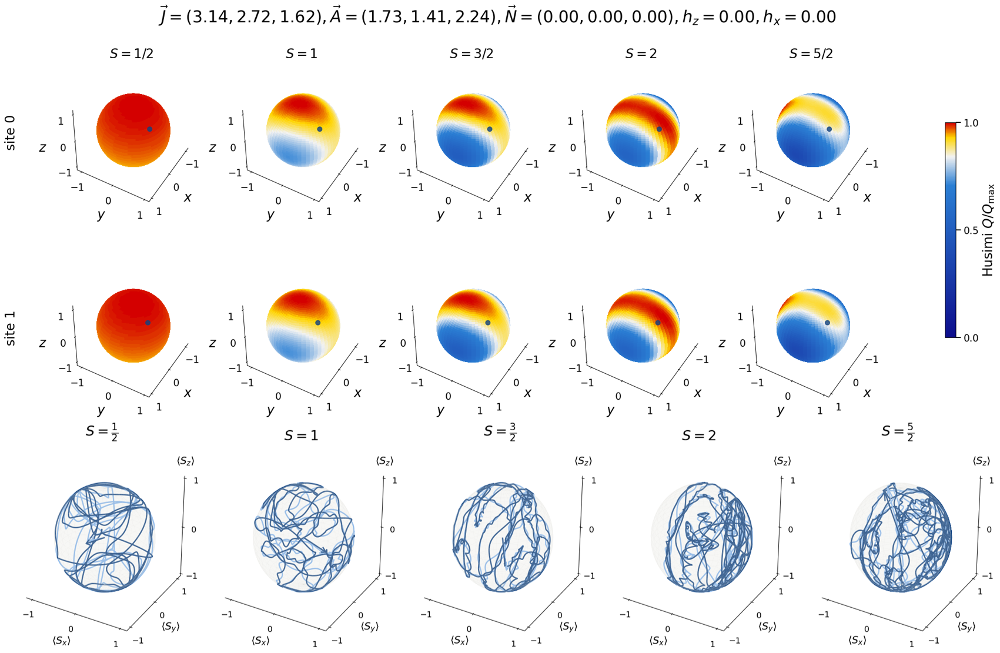

# Quantum-Chaos

Matrix-product-state simulations of chaotic quantum spin chains. The code time-evolves a spin
chain with TDVP and reconstructs the **time-averaged Husimi $Q$-function** of a single site on the
Bloch sphere, together with the trajectory of that site's spin expectation value.

The Husimi distribution is the phase-space picture of the reduced state: for an ergodic
(chaotic) site it spreads over the whole sphere, while regular dynamics or scarred /
"birthmarked" states leave sharp structure concentrated near the underlying classical orbits.
Comparing panels across spin $S$ probes how the semiclassical limit is approached.



<p align="center">
  <em>
    Husimi Q function and respective trajectories across different spin values
  </em>
</p>


<p align="center">
  <em>See <a href="Data.pdf">Data.pdf</a> for a gallery of generated figures (14 pages).</em>
</p>

## The model

`SpinModel` is a TeNPy `CouplingMPOModel` on an open chain of `L` spin-$S$ sites (no conserved
quantum numbers, so any field direction is allowed):

$$H = \sum_{i} \sum_{\alpha} J_\alpha S^\alpha_i S^\alpha_{i+1} + \sum_{i} \sum_{\alpha} N_\alpha S^\alpha_i S^\alpha_{i+2} + \sum_{i} \sum_{\alpha} A_\alpha \left(S^\alpha_i\right)^2+ \sum_{i} \left( h_x S^x_i + h_z S^z_i \right) $$

with $\alpha \in \{x, y, z\}$.

| Parameter | Meaning |
| --- | --- |
| `Jx, Jy, Jz` | nearest-neighbour exchange (anisotropic XYZ) |
| `Nx, Ny, Nz` | next-nearest-neighbour exchange |
| `Ax, Ay, Az` | single-ion (quadratic) anisotropy |
| `hx, hz` | uniform transverse / longitudinal field |
| `L`, `S` | chain length and on-site spin |

The default parameters are deliberately incommensurate — $\vec{J} = (\pi, e, \varphi)$ and
$\vec{A} = (\sqrt{3}, \sqrt{2}, \sqrt{5})$ — to avoid any accidental integrability or resonance
between the exchange and anisotropy scales.

## Method

1. **Initial state** — each site is prepared in a spin-coherent state $|\theta_i, \phi_i\rangle$,
   built in `coherent_state` by expanding $e^{-i\theta\, \hat{m}\cdot\vec{S}} |S, S\rangle$ in the
   $S^z$ basis. Angles are jittered around $(\pi/4, \pi/3)$ by a seeded RNG (`seed=42`), so the
   product state is a well-defined but non-symmetric point in phase space.
2. **Time evolution** — `TwoSiteTDVPEngine` propagates the MPS over `N_t` steps of size
   `dt = t_max / (N_t - 1)`, truncating at `chi_max = 100`, `svd_min = 1e-6`.
3. **Observables** — at every step the single-site reduced density matrix
   $\rho_i(t) = \mathrm{Tr}_{\neq i}\, |\psi(t)\rangle\langle\psi(t)|$ is extracted via
   `get_rho_segment`. From it come $\langle S^{x,y,z}\rangle(t)$ and the time-averaged state
   $\bar{\rho}_i$.
4. **Husimi function** — $Q(\theta, \phi) = \langle \theta, \phi | \bar{\rho}_i | \theta, \phi \rangle$
   is evaluated on an `N_theta × N_phi` grid over the sphere. Each run prints a sanity check
   ($\mathrm{Tr}\,\bar{\rho} = 1$ and $\mathrm{Im}\,Q \approx 0$).

`spectral()` is also provided: it computes the two-time correlator
$C_j(t) = \langle \psi | S^z_j(t)\, S^z_{L/2}(0) | \psi \rangle$ by evolving a bra and a ket MPS in
parallel and contracting them with an `MPSEnvironment` — useful for light-cone / spectral-function
plots. It is not called by the default run.

## Repository contents

| File | Description |
| --- | --- |
| [Main.ipynb](Main.ipynb) | The whole pipeline: model, simulation, plots |
| [Data.pdf](Data.pdf) | Generated figures (Husimi spheres, Bloch precession) |
| [Quantum many-body scars from unstable periodic orbits.pdf](Quantum%20many-body%20scars%20from%20unstable%20periodic%20orbits.pdf) | Reference paper |
| [Quantum Birthmarks - Ergodicity breaking beyond scarring.pdf](Quantum%20Birthmarks%20-%20Ergodicity%20breaking%20beyond%20scarring.pdf) | Reference paper |

## Requirements

Python 3.12 with:

```bash
pip install physics-tenpy numpy scipy matplotlib jupyter
```

## Usage

Open [Main.ipynb](Main.ipynb) and run the cells in order:

| Cell | Purpose |
| --- | --- |
| 0 | Imports |
| 1 | `SpinModel` definition |
| 2 | `simulation`, `spectral`, `coherent_state` |
| 3 | Parameters + main loop over spins and sites |
| 4 | Save results to `husimi_L{L}_J..._A....npz` |
| 5 | Husimi $Q$ painted on the Bloch sphere (grid: sites × spins) |
| 6 | Bloch-sphere spin precession trajectories |

Cell 3 holds every knob. The defaults are `L = 2`, `S ∈ {1/2, 1}`, `N_t = 10000` steps to
`t_max = 100`, and a `60 × 60` sphere grid; it runs the evolution once per (spin, site) pair.
Increasing `L`, `S`, or `chi_max` raises the cost quickly — start small.

Cell 4 writes an `.npz` containing `Q`, `Sx`, `Sy`, `Sz`, `times`, and all model parameters, so the
plotting cells can be re-run without repeating the evolution.

### Plot options

Cell 5 exposes `trajectory`, `quiver`, and `initial_condition` flags, plus the `elev`/`azim`
viewing angles. The colormap applies a quartic ramp so that low-$Q$ structure stays visible
alongside sharp peaks. Cell 6 has `t_idx` (which time the instantaneous arrow marks) and
`Normalize` — with `Normalize = False`, $|\vec{n}| = |\langle \vec{S}\rangle| / S < 1$ measures how
strongly the site has become entangled with the rest of the chain.

## Note:

READ.md generated by Claude Code

## License

MIT — see [LICENSE](LICENSE). Copyright (c) 2026 Lucas Queiroz Silveira.
